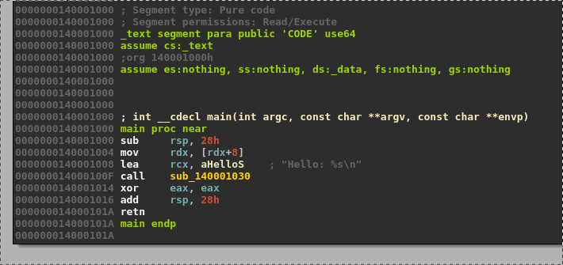
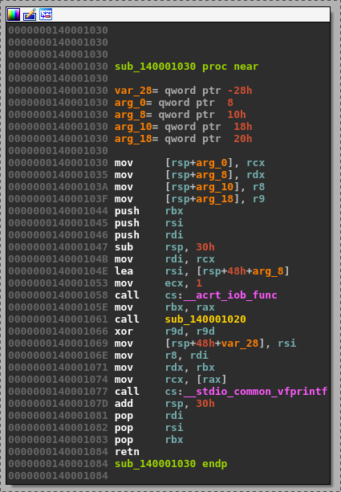
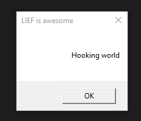

06 - PE Hooking
---------------

The objective of this tutorial is show how we can hook imported functions

Scripts and materials are available here: `materials <https://github.com/lief-project/tutorials/tree/master/06_PE_hooking>`_

------

The targeted binary is a simple ``PE64`` *HelloWorld* which prints the first argument on in the console:

.. code-block:: cpp

  #include "stdafx.h"
  #include <stdio.h>

  int main(int argc, char** argv) {
    printf("Hello: %s\n", argv[1]);
    return 0;
  }

.. code-block:: console

  $ PE64_x86-64_binary_HelloWorld.exe World
  $ Hello: World

Using LIEF, we will hook the function that prints string in the console to print it in a ``MessageBox``

By disassembling the binary we can see that the *print* occurs in the ``sub_140001030`` function and uses two
external functions: ``__acrt_iob_func`` and ``__stdio_common_vfprintf``.

Due to the Microsoft x64 calling convention, the format is located in the ``rcx`` and the input message in the ``rdx`` register.

Basically the hooking code will hook the ``__acrt_iob_func`` function and shows a ``MessageBox`` with the ``rdx`` message.

First we create the ``.htext`` section which will holds the hooking code:

.. code-block:: python

  section_text                 = lief.PE.Section(".htext")
  section_text.content         = code
  section_text.virtual_address = 0x7000
  section_text.characteristics = lief.PE.SECTION_CHARACTERISTICS.CNT_CODE | lief.PE.SECTION_CHARACTERISTICS.MEM_READ | lief.PE.SECTION_CHARACTERISTICS.MEM_EXECUTE

  section_text = pe.add_section(section_text)

Then ``.hdata`` section for the ``MessageBox`` title:

.. code-block:: python

  title   = "LIEF is awesome\0"
  data =  list(map(ord, title))

  section_data                 = lief.PE.Section(".hdata")
  section_data.content         = data
  section_data.virtual_address = 0x8000
  section_data.characteristics = lief.PE.SECTION_CHARACTERISTICS.CNT_INITIALIZED_DATA | lief.PE.SECTION_CHARACTERISTICS.MEM_READ | lief.PE.SECTION_CHARACTERISTICS.MEM_WRITE

  section_data = pe.add_section(section_data)

As the ASLR is enabled we will disable it to avoid to deal with relocations:

.. code-block:: python

  binary.optional_header.dll_characteristics &= ~lief.PE.DLL_CHARACTERISTICS.DYNAMIC_BASE

We will also disable the ``NX`` protection:

.. code-block:: python

  binary.optional_header.dll_characteristics &= ~lief.PE.DLL_CHARACTERISTICS.NX_COMPAT

As ``ExitProcess`` is not imported in ``KERNEL32.dll`` we need to add it:

.. code-block:: python

  kernel32 = binary.get_import("KERNEL32.dll")
  kernel32.add_entry("ExitProcess")

The ``MessageBoxA`` function is located in the ``user32.dll`` thus we have to add it:

.. code-block:: python

  user32 = binary.add_library("user32.dll")
  user32.add_entry("MessageBoxA")

The we process to the hook of the ``__acrt_iob_func`` function:

.. code-block:: python

  pe.hook_function("__acrt_iob_func", binary.optional_header.imagebase + section_text.virtual_address)

And finally we configure the :class:`~lief.PE.Builder` to create a new import table and to patch the original one with trampolines.

.. code-block:: python

  builder = lief.PE.Builder(binary)

  builder.build_imports(True).patch_imports(True)

  builder.build()

  builder.write("lief_pe_hooking.exe")

Now we can run the final executable:

.. code-block:: console

  $ lief_pe_hooking.exe "Hooking World"

